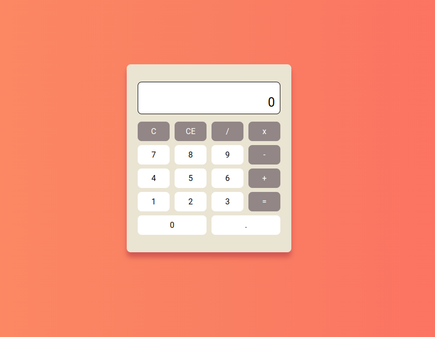

<h1 align="center">Calculadora web</h1>

# Sobre o projeto

Neste desafio desenvolvi uma calculadora web, para treinar ainda mais lógica de programação com Javascript.

## Tecnologias usadas 🚀

- HTML
- CSS
- Javascript

## Imagens ✨

  

